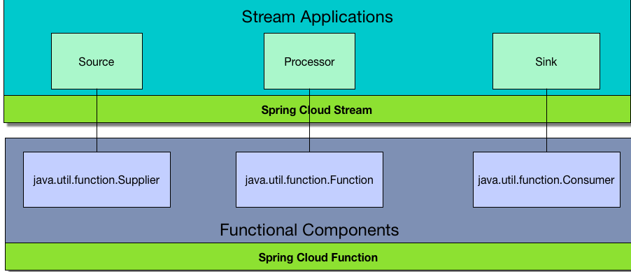
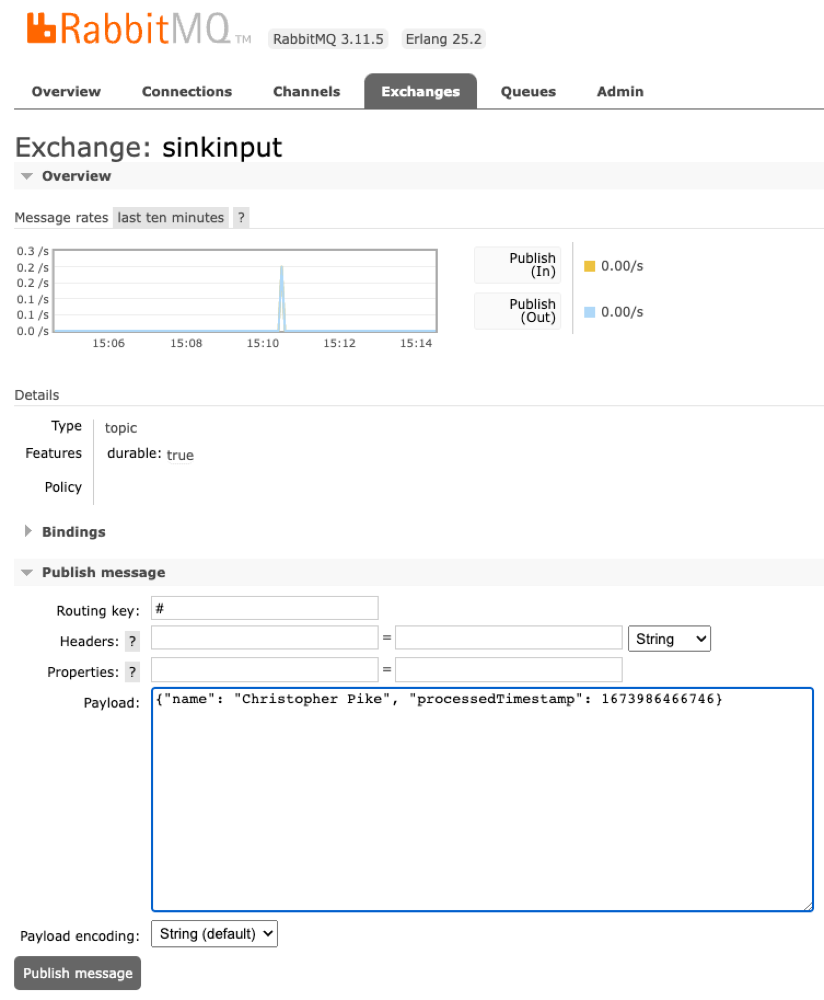
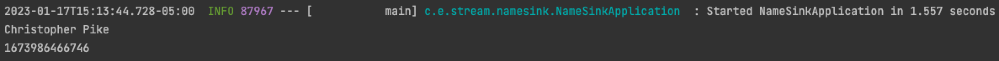
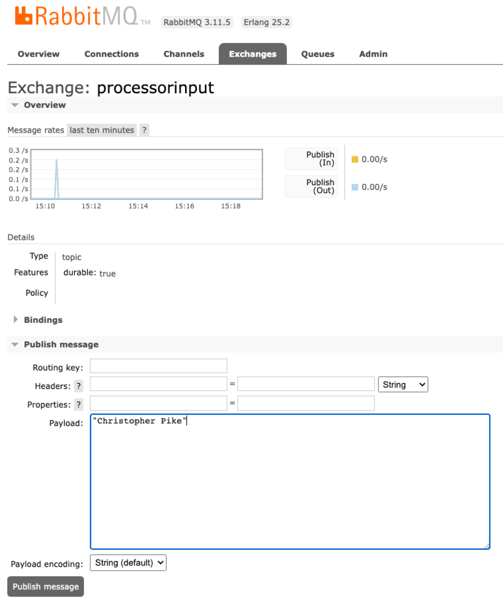
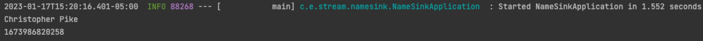

== Getting Started with Spring Cloud Stream
This guide walks you through an overview of Spring Cloud Stream and the process of creating an event-driven
streaming application.

== Starting with Spring Initializr

You can use this https://start.spring.io/#!type=maven-project&language=java&platformVersion=3.0.1&packaging=jar&jvmVersion=17&groupId=com.example.stream&artifactId=name-sink&name=name-sink&description=Demo%20project%20for%20Spring%20Boot&packageName=com.example.stream.name-sink&dependencies=cloud-stream,amqp[pre-initialized project] and click *Generate* to download a ZIP file. This project is configured to fit the examples in this tutorial.

To manually initialize the project:

. Navigate to https://start.spring.io.
This service pulls in all the dependencies you need for an application and does most of the setup for you.
. Choose either Gradle or Maven and the language you want to use. This guide assumes that you chose Java.
. Click *Dependencies* and select _Cloud Stream_ and _Spring for Rabbit MQ_.
. Click *Generate*.
. Download the resulting ZIP file, which is an archive of a task application that is configured with your choices.

NOTE: If your IDE has the Spring Initializr integration, you can complete this process from your IDE.

NOTE: You can also fork the project from GitHub and open it in your IDE or other editor.

=== What is Spring Cloud Stream?
A framework for building event-driven Spring Boot microservices for real-time stream processing. You can learn more about
the framework from the link:https://spring.io/projects/spring-cloud-stream[project-site],
link:https://spring.io/projects/spring-cloud-stream#learn[documentation],
and link:https://github.com/spring-cloud/spring-cloud-stream-samples[samples].

=== Stream Processing Application Overview

This guide demonstrates the capability of Spring Cloud Stream. We create three applications to showcase the different
functionalities of Spring Cloud Stream.

- name-source: Publish a String at a regular interval to initiate the stream. For this example, publish a name as a String.
- name-processor: Consume the String published by name-source and transform the data in some way. Publish the results to a different exchange.
For this example, use the name String to create a record and add a timestamp.
- name-sink: Consume the results from name-processor and perform an action. In this case, print the results to standard out.

For this example, the names of the applications follow the Spring Cloud Stream concepts (`Source`, `Processor`, `Sink`). These concepts map
to the logical equivalent of the Java 8 functions (`Supplier`, `Function`, `Consumer`, respectively).
While Spring Cloud Stream can support one or more Function instances in a Source as well as in a Sink (via function composition), we have three separate applications to demonstrate how each can work as an independent application.



In this guide, we work from the back to the front. That is, we first build the Sink application, followed by the Processor, and
finally build the Source. We use the RabbitMQ dashboard UI to test each component as we go.

=== Install Prerequisite - RabbitMQ

To use Spring Cloud Stream functionality, we need to ensure that a message broker is accessible. For this guide, we use RabbitMQ.
If a local Docker environment is found, the following command can start RabbitMQ:
```shell
docker run -d --hostname my-rabbit --name some-rabbit -p 15672:15672 -p 5672:5672 rabbitmq:3-management
```

The result is that RabbitMQ should be link:http://localhost:15672/[accessible locally] with the username/password of `guest/guest`.


== Sink Application

The sink (`java.util.function.Consumer`) is defined in `NameSinkConfiguration` as:

====
[source,java,tabsize=2,indent=0]
----
include::name-sink/src/main/java/com/example/stream/namesink/NameSinkConfiguration.java[tag=namesink]
----
====

Starting this application without configuring the exchange name automatically generates an exchange named `nameSink-in-0` in RabbitMQ.
We want to customize this exchange so that we can later hook our processor to our sink.

====
[source,tabsize=2,indent=0]
----
include::name-sink/src/main/resources/application.properties[tag=sinkexchangeconfig]
----
====


To test the sink, we manually publish a JSON message representing a `Person` record to the newly generated exchange:



Also, in our application logs we should see the data outputted:




== Processor Application

The processor (`java.util.function.Function`) is defined in `NameProcessorConfiguration` as:

====
[source,java,tabsize=2,indent=0]
----
include::name-processor/src/main/java/com/example/stream/nameprocessor/NameProcessorConfiguration.java[tag=processname]
----
====

This function takes a String value as input and creates a new Person record that adds the timestamp of when the data was processed.
Running this application creates two new exchanges in RabbitMQ: `processName-in-0` and `processName-out-0`.
Similar to the configuration we applied to the sink application, we want to change these exchange names so they can hook into the
sink and, soon, to the supplier.

====
[source,tabsize=2,indent=0]
----
include::name-processor/src/main/resources/application.properties[tag=processorexchangeconfig]
----
====

NOTE: The output of the processor matches the input of the sink.

Using the RabbitMQ dashboard, we can now send a String (name) to the processor input exchange and watch as it flows to the connected sink.



If the processor and the sink are connected properly, you should see the output from your running sink:



== Source Application


The Source (`java.util.function.Supplier`) is defined in `NameSourceConfiguration` as:

====
[source,java,tabsize=2,indent=0]
----
include::name-source/src/main/java/com/example/stream/namesource/NameSourceConfiguration.java[tag=supplyname]
----
====

Similar to how we hooked up the processor output to the sink input, we must do the same and connect the source output to the
processor input.

====
[source,tabsize=2,indent=0]
----
include::name-source/src/main/resources/application.properties[tag=supplierexchangeconfig]
----
====

NOTE: The output of the source should match the input of the processor.

If `name-processor` and `name-sink` are already running, starting the `name-source` immediately starts messages flowing through the system.
You should see the same name continuously produced by `name-sink` with a slightly different timestamp for when the message
passed through the processor. No more RabbitMQ dashboard testing required!  You now have a fully functioning stream application.

== Summary
Congratulations! You have completed Spring Cloud Stream's high-level overview, and you were able to build and test
Spring Cloud Stream applications that communicate with RabbitMQ.
